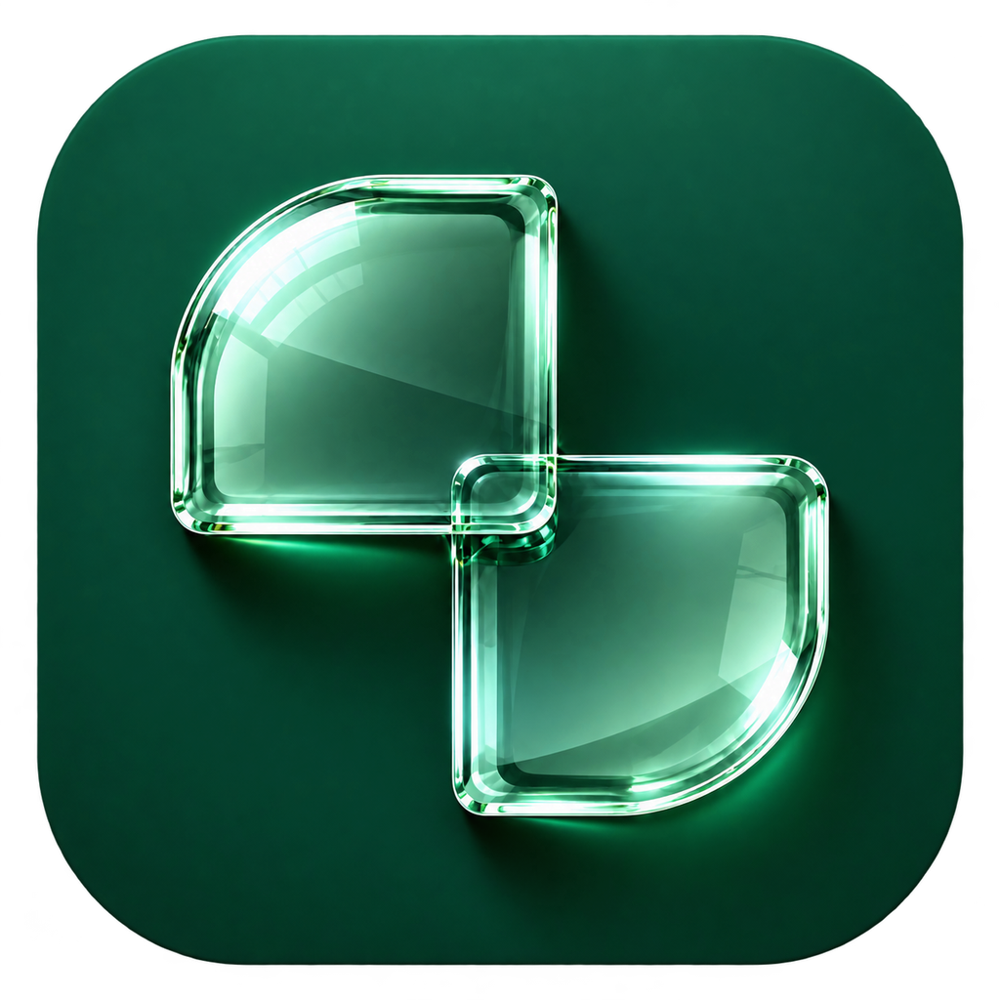

<p align="center"></p>

# Diagonal

Dia-style tab groups for Chromium browsers on macOS (Brave, Chrome, Edge, Vivaldi, Arc, Opera, …), named by Apple's on-device model through the `fm` command-line tool over Chromium native messaging. No HTTP server, no cloud call, no model download.

You open and close tabs as usual. Diagonal does the rest on its own; there are no shortcuts and nothing to press.

1. **Opener grouping.** Cmd-click a link from an ungrouped, unpinned tab and both tabs become a group, titled with the site's hostname until the model names it.
2. **Auto-organize.** Any other loose tab (typed address, bookmark, new window) is sorted once the window has been quiet for 8 s: it joins one of Diagonal's groups, pairs up with other loose tabs on the same topic, or stays loose if nothing fits. A loose tab is looked at again only when it goes to another page or a new tab arrives that it might pair with.
3. **Naming loop.** Groups Diagonal made get an `emoji + 2–4 word` title from the model. The title is recomputed after 4 s of quiet when membership changes, stays put when the model only paraphrases, and is never touched again once you type a title yourself.
4. **Dissolve.** A group Diagonal made that drops to one tab is ungrouped, unless you gave it a title.
5. **Drift.** When a tab in a group Diagonal made goes to a page on a different topic, it leaves the group once you switch away from it, and auto-organize files it with its new topic. Diagonal compares its topic with up to five groupmates (`src/background/fit.ts`) and only moves it when those groupmates still agree with each other.
6. **Tidy.** Tabs idle for 24 h move to a collapsed grey "Parked" group at the end of the strip. Opening a parked tab takes it back out and auto-organize places it. After another 48 h in Parked, tabs are archived and closed, with restore from the popup.

Your own choices win: a tab you take out of a group stays out until it goes to another page, a tab you drag into a group stays there, groups you make or rename yourself are left alone, and a title you type is kept. The popup still has **Organize now**, **Tidy now** and their undo, but none of them is needed.

The model sees a tab's title, its address, and up to 500 characters of what the page says: its description tag, its main heading and the opening lines of its main text (never form fields). Settings → Privacy can leave the page text out or send only the site name. When a batch of tabs doesn't fit the model's context, the page text is shortened first, then dropped.

## Requirements

- A Chromium browser based on Chromium 121 or newer that lets extensions manage tab groups (`chrome.tabGroups`). Chrome, Brave (including Brave Origin), Edge and Chromium do. Browsers with their own tab grouping, such as Arc, Opera and Vivaldi, may not expose it; if so, Diagonal's popup says so and it stays idle.
- macOS 27 on Apple silicon, with Apple Intelligence on and the on-device model downloaded (`/usr/bin/fm` ships with macOS 27)
- Python 3 (standard library only) for the host

## Install

### With Homebrew

```sh
brew install iko-soy/tap/diagonal
```

This downloads the latest release, puts the extension at `~/Library/Application Support/Diagonal/extension`, installs the native host and registers it with every Chromium browser on the Mac.

Apple's `fm` tool refuses to run until its terms are accepted once per Mac. If they aren't yet, the install shows them (through `sudo fm license`, so it asks for your password) and you agree or decline there. If you decline, the install still finishes and tells you to run `sudo fm license` when you're ready; until then Diagonal's popup says the same. The install ends with "Diagonal's host is ready." once everything works.

Then load the extension once, in each browser you use:

1. Open `chrome://extensions` (it works in Brave, Edge and the rest too) and turn on **Developer mode**.
2. Click **Load unpacked**, press **Cmd+Shift+G** and paste `~/Library/Application Support/Diagonal/extension`.

Updates come with a plain `brew upgrade`: the tap's cask moves to each new release within half an hour (`.github/workflows/diagonal.yml` in iko-soy/homebrew-tap). Diagonal then notices the newer files on disk and reloads itself within a couple of minutes, or as soon as you open its popup, so there is nothing to click. `brew uninstall diagonal` removes the extension folder, the host and its manifests from every browser; `brew uninstall --zap diagonal` also removes the fm schemas and logs.

Chromium browsers only install extensions on their own from a web store, so the one Load unpacked step stays until Diagonal is published there. Everything the Chrome Web Store asks for is ready in [docs/store/listing.md](docs/store/listing.md), with the policy in [PRIVACY.md](PRIVACY.md); a store install still needs the Homebrew helper above.

### From a release zip

1. Download `diagonal-extension-<version>.zip` from the [latest release](https://github.com/iko-soy/diagonal/releases/latest) and unzip it somewhere it can stay, for example `~/Applications/Diagonal`.
2. Open `chrome://extensions`, turn on **Developer mode**, click **Load unpacked** and pick that folder.
3. Install the native host once, from Terminal:

   ```sh
   bash ~/Applications/Diagonal/install-host.command
   ```

   (Type `bash `, then drag `install-host.command` from the folder into the Terminal window.) If it says python3 is not set up, run `xcode-select --install` and try again. It shows Apple's terms for `fm` if they haven't been accepted on this Mac yet, and ends with "Diagonal's host is ready." when everything works.
4. Open Diagonal's settings and click **Run check** under "Connection to the model". The browser does not need a restart.

The zip carries the host (`host/`), `extension-id` and `install-host.command`, which is the same script as `scripts/install-manifest.sh`. When you update to a newer release, rerun step 3.

### From source

#### 1. The extension

1. `npm ci && npm run build` writes the unpacked extension to `dist/`.
2. Open `chrome://extensions`, turn on **Developer mode**, click **Load unpacked** and pick `dist/`.
3. Check that the ID shown is `mpnodlalikgeehnlnofdkpgapkmbkjdf`. It is pinned by the `key` in `manifest.json`, so it stays the same across reloads and machines.

#### 2. The native host

Without Nix:

```sh
scripts/install-manifest.sh
```

This copies `host/` to `~/.local/share/diagonal-host`, links `~/.local/bin/diagonal-host`, pins its shebang to your `python3`, runs `diagonal-host --register`, which writes `io.diagonal.host.json` into the `NativeMessagingHosts` folder of every Chromium browser's profile folder under `~/Library/Application Support` (known ones such as `Google/Chrome`, `BraveSoftware/Brave-Origin`, `Microsoft Edge`, `Arc/User Data`, plus any other folder with a Chromium `Local State` and browsing history) and checks each one the way the browser reads it, then runs `diagonal-host --install-schemas`, then `diagonal-host --selftest`.

With Nix (nix-darwin + home-manager):

```nix
# flake inputs
diagonal.url = "path:/path/to/diagonal";   # or a git URL once it lives in a repo

# home-manager config
imports = [ inputs.diagonal.homeManagerModules.default ];
programs.diagonal.enable = true;
# programs.diagonal.browsers = [ "BraveSoftware/Brave-Origin" "Google/Chrome" ];
```

`nix build .#extension` builds `dist/` into `./result`; `nix build .#diagonal-host` builds the host.

#### 3. Check it

Open Diagonal's settings page and click **Run check**. It should say "Working" and show a title for a sample group; the full result (`fmAvailable: true`, `schemasOk: true`) is under Troubleshooting. From a terminal, `diagonal-host --selftest` runs the same checks.

## Develop

```sh
npm ci
npm run build          # dist/
npm run watch          # rebuild on change
npm run typecheck
npm test               # vitest: engine, naming, organize, tidy, url, property tests
npm run test:host      # unittest: framing, origin, every error code, prompts, validators
npm run smoke          # Linux: loads dist/ in Chromium with the real host and a fake fm, then checks self-update
npm run zip:store      # diagonal-store.zip for the Chrome Web Store (no pinned key, no bundled host)
npm run check          # typecheck + both unit suites
```

Layout follows the spec: `src/background/` (engine, naming, organize, tidy, host client, state, settings), `src/content/meta.ts`, `src/popup/`, `src/options/`, `src/shared/`, and `host/` (`diagonal-host.py`, `prompts.py`, `validate.py`, `emoji.txt`, `tests/`).

`host/emoji.txt` is the single emoji list. `npm run gen-emoji` regenerates `src/shared/emoji.gen.ts` from it.

### Releases

Every push to `master` runs `.github/workflows/release.yml`: it typechecks, runs both test suites, builds with the manifest `version` set to the commit's UTC time as `YYYY.MM.DD.HHMM`, and publishes a GitHub release tagged with that version, with `diagonal-extension-<version>.zip` attached. Two commits in the same minute share a release; the later one replaces its zip. Locally, `DIAGONAL_VERSION=2026.09.23.1619 npm run build` produces the same stamped build.

### Pinning a different extension ID

`scripts/gen-key.sh` creates `key.pem` if it is missing, writes the public key into `manifest.json`, the ID into `extension-id` and into `ALLOWED_ORIGIN` in `host/diagonal-host.py`, and prints the ID. The shipped ID comes from a key that is not included; you only need the private key to pack a `.crx`. Running the script without a `key.pem` makes a new key and a new ID, so after that rebuild and rerun the host installer.

## Where this differs from the spec, and why

- **Fully automatic.** The spec's keyboard commands are gone (new tab in group, organize, rename, tidy now). Organize runs on its own for loose tabs, the tidy sweep parks without asking by default (Ask mode is still a setting), and topic groups dissolve at one tab like opener groups do.
- **Model calls are one at a time.** Naming and auto-organize share a queue, so they never run the model in parallel.
- **Query strings.** The spec keeps the query only when the path is empty, but also wants `youtube.com/watch?v=…` kept. Diagonal keeps the whole query when the path is empty and otherwise keeps only content keys (`v`, `q`, `query`, `search_query`, `search`, `s`, `k`, `id`, `p`, `list`, `page`), dropping `utm_*` and similar.
- **Grey is reserved for the Parked group.** Site colours hash over the other eight colours.
- **Organize only adds tabs to Diagonal's own groups,** not to groups you made by hand, unless "Name my own groups" is on.
- **An Organize group whose title fails validation is still created,** with the hostname as a placeholder, and the naming loop names it.
- **Restarts.** Tab and group IDs change when the browser restarts, so records are matched to live groups by title and colour, which keeps managed groups managed.

## How fm behaves on macOS 27

Checked on a Mac running macOS 27.0 (26A428) on 2026-09-24; the tests' fake `fm` follows it.

- `fm` is at `/usr/bin/fm`. Until an admin runs `sudo fm license`, every command exits 69 with a terms notice; `fm license --status` reports the state. The installer offers the terms in the terminal; if they are declined, Diagonal reports `LICENSE_REQUIRED` with the fix. The host writes its schemas on first use, so install order does not matter.
- `fm schema object` builds the schemas. A nested object needs its own schema: `--object tabs --schema "<json from another fm schema object>" --array` (see `SUB_SCHEMAS` in `host/diagonal-host.py`).
- Organize asks for one broad topic per tab ("Programming", "Travel"), and the host groups tabs that share one, joins a topic to an existing group when that group's example tabs got the same topic, and names each new group with the name call. Asking the model for whole groups did not work: it put nearly every new group into existing group 0, and specific topics gave every tab its own.
- `fm respond` reads the prompt from stdin when no prompt argument is given. The host passes its fixed rules with `-i` and the tab text on stdin, so tab titles never show in the process list and are harder to use to override the rules. There is no timeout flag; the host enforces its own.
- The only model is `system` (`--model pcc` is rejected), so Diagonal always uses the on-device model.
- The context holds prompt and reply together: a 7,400-token prompt worked and 13,100 overflowed. Tokens per character differ a lot by language (English 0.26, Russian 0.31, Chinese 0.54, Japanese 0.51), so the host budgets tokens, not characters: `TOKEN_BUDGET` is 7,000. It estimates from the characters and, near the limit, asks `fm count-tokens -q -i ...` (under 0.1 s) for the exact number. `count-tokens` accepts `-i` but not `--schema`.
- `--greedy` makes answers repeatable: five runs gave one answer, where default sampling gave three different names and sometimes split topics ("Finance" and "Banking"). The host always passes it.
- `fm serve` (an OpenAI-style server on a port or unix socket, with `json_schema` output) saved only about 100 ms per call once warm, can't take `--greedy` or guardrail settings, and on a TCP port answers any web page (it reflects any CORS origin). Diagonal keeps spawning `fm respond`.
- The safety layer sometimes refuses harmless text ("The model's safety guardrails were triggered."). The host retries such a call once with `--guardrails permissive-content-transformations`.
- Reply JSON key order is not stable, and the model can list a tab both in a group and in leftovers; the validator handles both.

Still open: the Nix flake builds both packages on Linux and Apple silicon in CI, but the home-manager module has not been activated on a real Mac.
